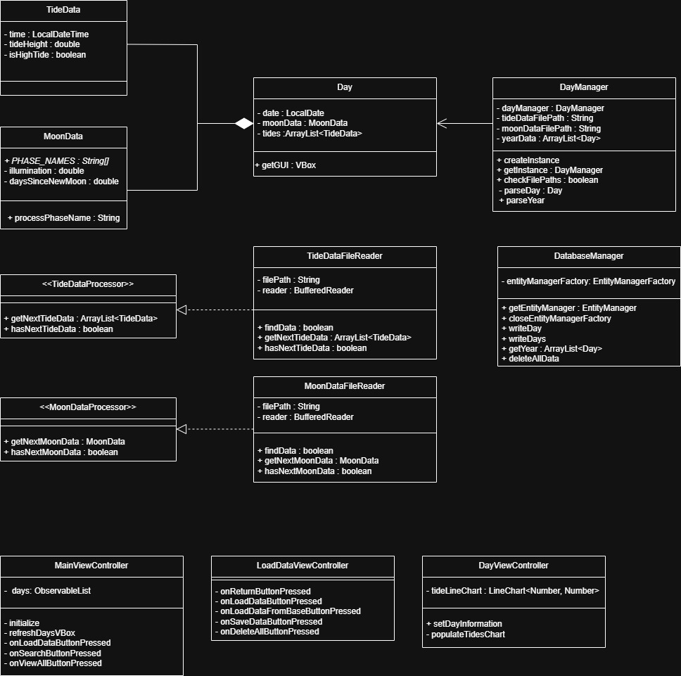

# tide-data-tracker
This application processes tide and moon data files to generate records for each day of the year. The data can be saved  
to or loaded from a MySQL database. Users can search for days that match specific tide and moon conditions. Up to four  
tides can occur each day. The moon phase, tide height, and timing of the tides are visualized in a line chart for each  
day.  

## Features
- Generate daily tide and moon records for the entire year.
- Search through data using various tide parameters.
- Save and load data from a MySQL server.

## Prerequisites
- [Java](https://adoptopenjdk.net/) (11 or higher recommended)
- [Maven](https://maven.apache.org/) (for dependency management)
- [MySQL Server](https://www.mysql.com/) (optional)
- [IntelliJ IDEA](https://www.jetbrains.com/idea/) (recommended)

## Loading/Saving Data
Tide and moon data files in txt format can be found for free online.  
Tide data from NOAA: https://tidesandcurrents.noaa.gov/tide_predictions.html?gid=1393  
Moon data from NASA: https://svs.gsfc.nasa.gov/  

Click on the "Load/Save Data" button, enter the file paths, and select "Load From Files".

Then click the "return" and select "View All" after a few seconds the data should be displayed.  

A `database.properties` file is required to connect to your MySQL Server.  
This file should be located inside the `resources` directory.

Example `database.properties` file:

javax.persistence.jdbc.url=jdbc:mysql:yourUrlHere  
javax.persistence.jdbc.user=yourUsernameHere  
javax.persistence.jdbc.password=yourPasswordHere  

## UML Diagram

